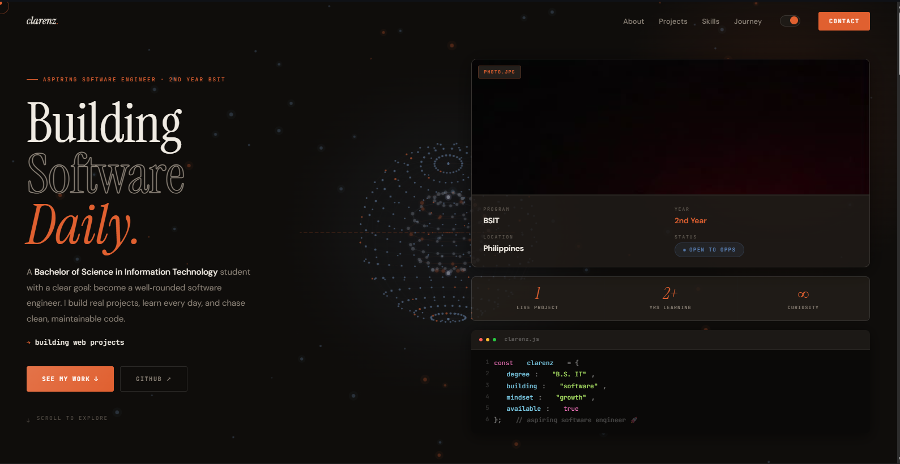

# Clarenz Kyle Z. Rocas — Portfolio

> Live preview of this repository: **[Open my portfolio page](./index.html)**

---

<!-- GitHub README preview -->
<!-- Note: GitHub renders markdown, but it does not always allow fully interactive iframes in READMEs.
     This section provides a graceful fallback: a big clickable screenshot + a direct link to index.html. -->

## Preview

## What you’re viewing

- A single-page portfolio built with **HTML + CSS + JS**
- Styling is in **css/style.css**
- Interactions are in **js/script.js**

---

## Quick links

- **Portfolio (HTML):** [index.html](./index.html)
- **Resume:** [cv/clarenz_resume.html](./cv/clarenz_resume.html)
- **GitHub profile:** https://github.com